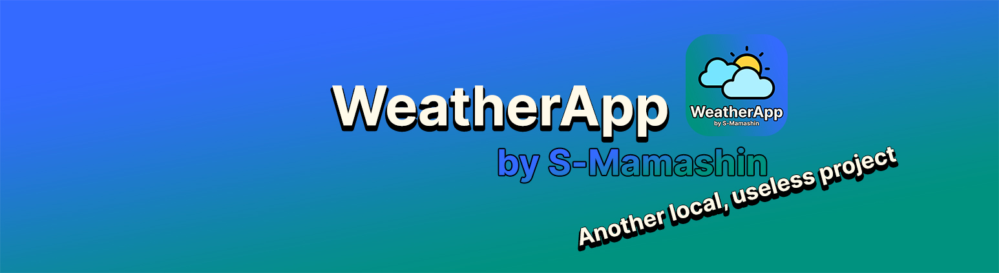

# WeatherApp with WebUi


## ___WeatherApp___ - a local project written to improve knowledge.

### ___About the project___
This application is like https://github.com/SMamashin/WeatherApp-Qt5 allows you to get detailed weather at the moment in any existing* city or country. 🌤

---
### ___Features of my project___ 
* Maximally open source
* Unique design
* Two versions on eel/js & only PyQt

The backend of this version is written in Python 🐍 & JavaScript ☕️
Frontend is implemented in html & css/js 🌈

---
### ___PIP modules that I used in this* version___
* Eel
  * Makes it possible to run html as a separate application
  * weather.py
   ```python
    eel.start("ui.html", size=(1089, 959))
   ```
   * ui.html
   ```javascript
         async function display_weather() {
            let city = document.getElementById("location").value;

            let search = await eel.get_weather(city)();
            document.getElementById("info").innerHTML = search;

            let error = await eel.get_weather(error)();
            document.getElementById("info").innerHTML = error;

            
        }

        $("#btn").on('click',function() {
            display_weather()
        });
        
* PyOWM
   * Get weather
  * Get detailed status
  * In these variables I got detailed information
      ```python
        tg = weather.temperature("celsius")
        local_temp = tg['temp']
        f_like = tg['feels_like']
        max_temp = tg['temp_max']
        min_temp = tg['temp_min']
        wind = weather.wind()['speed']
        pressure = weather.pressure['press']
        moisture = weather.humidity
        status = weather.detailed_status
---
### ___How to build?___
To run the code you will need Python on your PC and also install a couple of modules
  * pip install eel
  * pip install pyowm
    
You can also build the code in .exe using <u>Pyinstaller</u>
  * pip install pyinstaller
  * pyinstaller -F weather.py
    
Compiled .the exe will be waiting for you in the "dist" folder

---

### ___ChangeLog___
Version 1.0
 * The idea is considered
 * Connected EEL to work with the web interface instead of Qt
 * Selection of the main colors of the application
 * Selecting the background for the application
 * Multiple jumpers for a fraction of the design and size
 * 15.06.2023 - the main function works fine

Version 2.0
 * Huge work in terms of design
 * States are registered :active & :hover
 * Upload the source code to GitHub
 * The project has received a unique design
 * Brain improvement weather.py
 *  Greeting in #info
 * The main gradient is selected
 * Rewritten return information to f-string
 * Added beta check for detailed.status
 * Trial compilation in .exe
 * Added an array with emoji
 * Added some jquery on top of js
 * The application icon is drawn
 * Fitting the main interface to one
 * ChangeLog introduced

Version 3.0
 * The design has been brought to the final base
 * Designed ChangeLog
 * Correction of small things in terms of design
 * Small local changes
 * The idea to repeat on Flask
 * SVG from bootstrap-icons
 * Cleaning the code from unnecessary comments
 * The idea of transferring the design to Qt6
 * eel mode = "chrome"
 * Other minor changes

Version 4.0
 * Weather Emoji by Saxon
 * The development of the interface on Qt has begun
 * Converted .css
 * Interface repeated on Qt5

Version 5.0 = [First Version on Qt](https://github.com/SMamashin/WeatherApp-Qt5)


---
## Author
Stepan Mamashin

